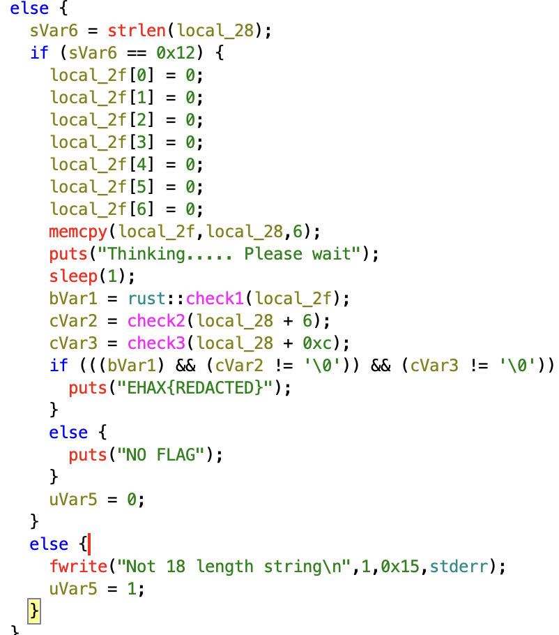

# Freaky_Friendly_interface

**Points:** 500  
**Category:** Rev  
**Author:** nrg

## Chalenge Description:

Mr. EHAX got freaky last night...

nc 20.40.45.50 1945

## handout

we are provided with a `chall` named binary file and an nc server on running the nc server we get

[nc server](nc.png)

## Solution walkthrough

Provided with a binary we need to decompile it using a software like ghidra and decode what the 18 length input is being asked in the nc

Here in ghidra decompiled c code we have `local_28` storing the input user data

[alt](array-string-input.png)

The main function consists of 3 function to check users input check1 check2 and check3



### check1

```rust

/* DWARF original prototype: bool check1(i8 * pattern) */

bool __rustcall rust::check1(i8 *pattern)

{
  u8 uVar1;
  bool bVar2;
  &str self;
  Utf8Error _e;
  usize len;
  AssertKind kind;
  bool cond;
  bool cond_1;
  bool cond_2;
  &str msg;
  usize *left_val;
  usize *right_val;
  &[u8] msg_1;
  ulong local_f0;
  u8 *local_e8;
  ulong uStack_e0;
  Arguments local_c0;
  usize local_90;
  undefined1 local_81;
  undefined8 local_80;
  bool local_4b;
  char local_4a;
  bool local_49;
  i8 *local_48;
  undefined8 *local_30;
  usize *local_28;

  local_48 = pattern;
                    /* try { // try from 00118d4f to 001190cd has its CatchHandler @ 00118d60 */
  core::ffi::c_str::CStr::from_ptr(pattern);
  core::ffi::c_str::CStr::to_str();
  if ((local_f0 & 1) == 0) {
    self.length = uStack_e0;
    self.data_ptr = local_e8;
    local_90 = core::str::len(self);
    local_30 = &DAT_001b6360;
    local_28 = &local_90;
    if (local_90 != 6) {
      local_81 = 0;
      local_80 = 0;
                    /* WARNING: Subroutine does not return */
      core::panicking::assert_failed<>();
    }
    if (uStack_e0 == 0) {
                    /* WARNING: Subroutine does not return */
      core::panicking::panic_bounds_check();
    }
    if (*local_e8 == 0x4c) {
      if (uStack_e0 < 2) {
                    /* WARNING: Subroutine does not return */
        core::panicking::panic_bounds_check();
      }
      local_4b = local_e8[1] == 0x4b;
    }
    else {
      local_4b = false;
    }
    if (local_4b == false) {
      local_4a = '\0';
    }
    else {
      if (uStack_e0 < 3) {
                    /* WARNING: Subroutine does not return */
        core::panicking::panic_bounds_check();
      }
      uVar1 = local_e8[2];
      if (((uVar1 == 0x23) || ((byte)(uVar1 - 0x25) < 2)) || (uVar1 == 0x40)) {
        local_4a = '\x01';
      }
      else {
        local_4a = '\0';
      }
    }
    if (local_4a == '\0') {
      local_49 = false;
    }
    else {
      if (uStack_e0 < 5) {
                    /* WARNING: Subroutine does not return */
        core::panicking::panic_bounds_check();
      }
      if (local_e8[4] < 0x31) {
        local_49 = false;
      }
      else {
        local_49 = local_e8[4] < 0x3a;
      }
    }
    if (local_49 != false) {
      if (uStack_e0 < 4) {
                    /* WARNING: Subroutine does not return */
        core::panicking::panic_bounds_check();
      }
      bVar2 = isUpper(local_e8[3]);
      if (bVar2) {
        if (uStack_e0 < 6) {
                    /* WARNING: Subroutine does not return */
          core::panicking::panic_bounds_check();
        }
        bVar2 = isUpper(local_e8[5]);
        return bVar2;
      }
    }
  }
  else {
    core::fmt::Arguments::new_const<1>(&local_c0,(&str (*) [1])&PTR_DAT_001effd0);
    std::io::stdio::_eprint();
  }
  return false;
}
```

For check1 a linker is used with rust binary the code involves basic if else which can be interpretted as :
str[0] is 0x4c that is L
str[1] is K
str[2] is 0x40 in ascii that is @
str[3] must be upper case that is take A
str[4] is greater than 0x31 and less than 3a that is it can be any number take 5
str[5] must be upper case that is take A

so the string that satifies it is
`LK@A5A`

### check2

for check2 it was pretty straight forward it takes in the next 6 letter and the condition is described by the below code:

```c
bool check2(long param_1)

{
  byte bVar1;
  ulong uVar2;
  ulong uVar3;

  bVar1 = 5;
  for (uVar3 = 0;
      (uVar2 = (ulong)bVar1, uVar3 <= uVar2 &&
      (*(char *)(param_1 + uVar3) == *(char *)(param_1 + uVar2))); uVar3 = uVar3 + 1) {
    bVar1 = bVar1 - 1;
  }
  return uVar2 < uVar3;
}
```

here, we have three variable bVar1, uVr2 and uVar3

with bvar1 initialised to 5, uvar3 to 0 and uvar 2 to bVar1 and uvar3 is incremented at each iteration of the for loop with the condition that `uVar3<=uVar2` and `(*(char *)(param_1 + uVar3) == *(char *)(param_1 + uVar2))); uVar3 = uVar3 + 1)`

what it means that

for,

- `uVar3=0,uVar2=5,bVar1=5`:

  6th array element (param_1 + uVar3 i.e local_28 + 6 + 0 ) = 11th element(param_1 + uVar2 i.e i.e local_28 + 6 + 5 )

- `uVar3=1,uVar2=4,bVar1=4`:

  7th array element (param_1 + uVar3 i.e local_28 + 6 + 1 ) = 10th element(param_1 + uVar2 i.e i.e local_28 + 6 + 4 )

- `uVar3=2,uVar2=3,bVar1=4`:

  8th array elemnt =9th element

- `uVar3=3,uVar2=2,bVar1=4`:

  Condition not matched exited from for loop

so , function return true when

str[6]=str[11]
str[7]=str[10]
str[8]=str[9]

so for our check 2 valid string can be

`111111`

### check3

```c

undefined4 check3(char *param_1)

{
  char cVar1;
  bool bVar2;
  undefined4 uVar3;


    // This is the code which check if str[0] and str[2] is clower case or not so a,a respectively matches
  cVar1 = isLower((int)*param_1);
  if ((cVar1 == '\0') || (cVar1 = isLower((int)param_1[2]), cVar1 == '\0')) {
    bVar2 = false;
  }
  else {
    bVar2 = true;
  }
//   here we have been provided with two options either two set str[1]='*' or '-' needing to match the condition accordingly
// if I chose it as '*' then then param_3 ascii value must lie between the ascii value of '/' and ':' that are all numbers so I chose 5 (it can be any value between 0-9 refer ascii table)
  if (param_1[1] == '*') {
    if (((bVar2) && ('/' < param_1[3])) && (param_1[3] < ':')) {
      bVar2 = true;
    }
    else {
      bVar2 = false;
    }
  }
  else if (param_1[1] == '-') {
    if (((bVar2) && ('@' < param_1[3])) && (param_1[3] < '[')) {
      bVar2 = true;
    }
    else {
      bVar2 = false;
    }
  }
  else {
    bVar2 = false;
  }
//   for str[4] must & and str[5] also must be &
  if (((bVar2) && (param_1[4] == '&')) && (param_1[5] == '&')) {
    uVar3 = 1;
  }
  else {
    uVar3 = 0;
  }
  return uVar3;
}
```

This code is quite straight forward it involves just basic if else conditioning it's explained with comments

so for out part 3 valid string can be:

`a*a5&&`

hence our final string becomes:

`LK@A5A111111a*a5&&`

### flag

[flag](flag.png)
