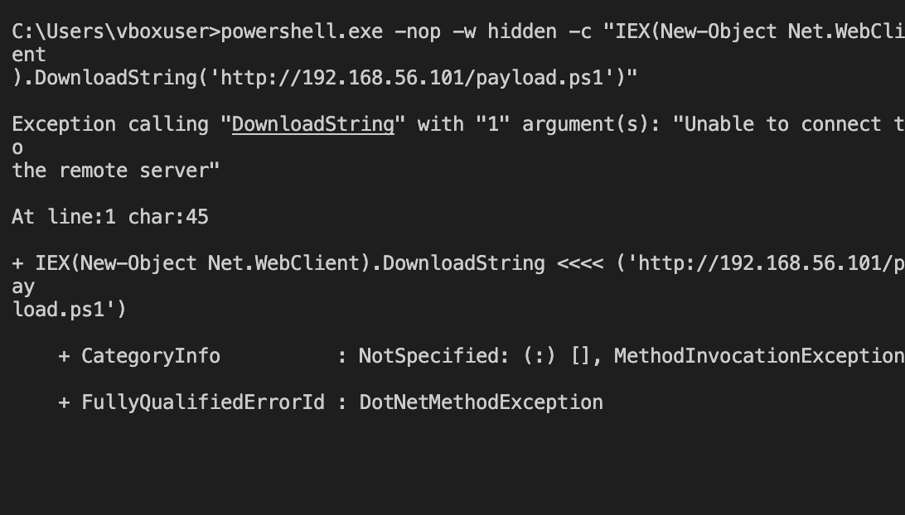
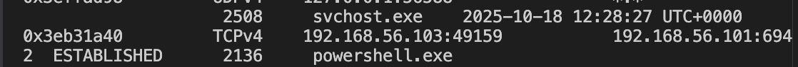
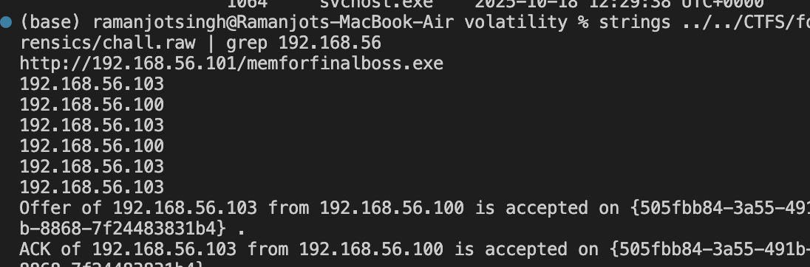
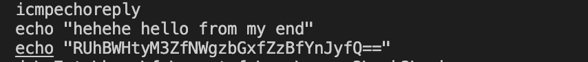

# GITM 1

**Points:** 500  
**Category:** Forensics  
**Author:** stapat

## Chalenge Description:

Mr ehax is very lazy and he slept while working , a attacker came a ran a malicious payload on his computer, can you help mr ehax to find the details of this attacker.

flag format EHAX{processname_ip+port_malware}

processname = name of the process he used for LOTL

ip+port = attackers ip + port used for communication ( ex = 0.0.0.0:4040)

malware = name of malware file he imported (ex - xxxxx.xxxx)

44b062c89abc5d25f930ec55e92a5745b36c6268fb2283957602f8f6381d7fb1 chall.raw

author - stapat

## Solution walkthrough:

### Step 1: Analyse the system of which the dump is

for profile of the file we can use imageinfo plugin
[terminal imageinfo output](imageinfo.png)

so, we can take the profile of our raw file as Win7SP1x86_23418

### Step 2: look for payload through which the attacker did the lotl

if you don't know what LOTL is then:

LOTL stands for Living Off the Land, a type of cyberattack where attackers use legitimate, pre-installed tools on a system to carry out malicious actions instead of introducing new malware.

we can look into the history of commands by using the consoles plugin

on which we are presented with an attempt to download a payload file but the download fails due to some error.

Alternately we can analyse the networks by using netscan to check if the attacker make any other network request

from this we can conclude that connection to 192.168.56.101:6942 was successful and the payload was downloaded and ran using powershell.exe now we need to find this payload for which I just ran strings on the chall.raw and grep the ip

I got the payload name that is memforfinalboss.exe

## flag for GTM1

so, our flag for GITM1 is
EHAX{powershell.exe_192.168.56.101:6942_memforfinalboss.exe}

## For gtm2 :

If attacker had left the message he must have used echo command so just

strings chall.raw and grep echo on it

we get 

## flag:

EHAX{r3v_5h3ll_g0_brr}
