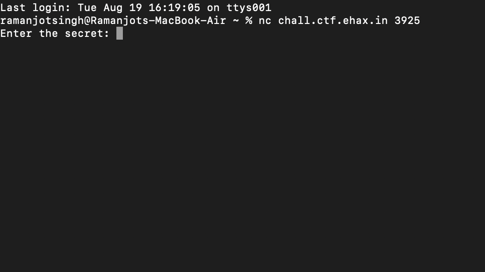
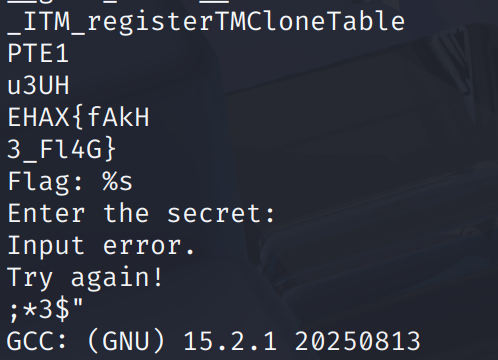
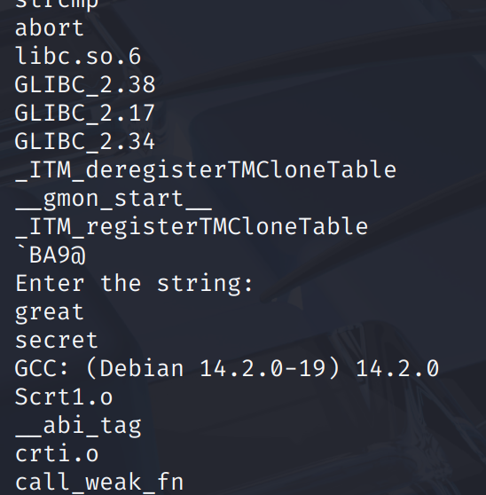
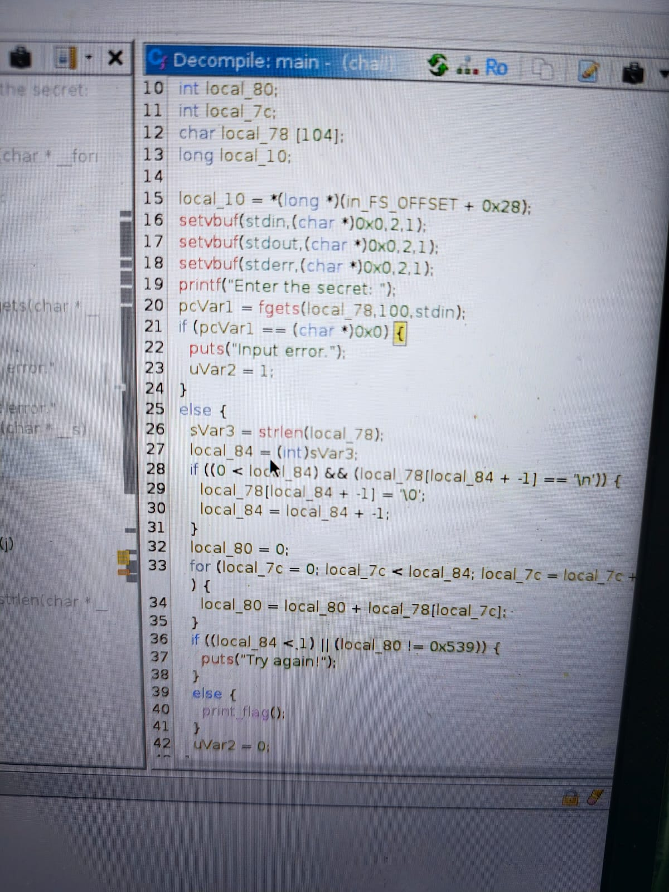

# Revv Me

**Points:** 300  
**Category:** Rev    
**Author:** frankhissss  

## Chalenge Description:

Just some code playing with numbers. If you get the math right, maybe something interesting will show up. `nc chall.ctf.ehax.in 3925`

https://drive.google.com/file/d/1QPqA1C1n1zvacQGkaH9x9D2ax6_W0W5h/view?usp=sharing

## Initial Thoughts:

The challenge belonged to reverse category which I haven't had practiced much before the CTF but I knew that we had to read the source code and analyse to get solve the challenge so I had somewhere to start.

## Solution Walkthrough
### 1. Exploring,Downloading source code and Figuring out how to run

First I ran the netcat of it



I downloaded the source code from the given gdrive booted my kali on virtual box and try to ran the code but the linux god have never shown mercy on my I always have to google after running some command and I got this error

```bash
┌──(ramanjot㉿vbox)-[~/Downloads]
└─$ ./chall           
zsh: exec format error: ./chall
```

I check what the file type was by running:
```bash
┌──(ramanjot㉿vbox)-[~/Downloads]
└─$ file chall
chall: ELF 64-bit LSB pie executable, x86-64, version 1 (SYSV), dynamically linked, interpreter /lib64/ld-linux-x86-64.so.2, BuildID[sha1]=d086379357bad9638b52d4cba6ee8cbb98f70313, for GNU/Linux 4.4.0, not stripped
```
So this executable was not supported by my system as I have an arm64 system now I tried to google out some tool which I can use to run x86_64 executables on my arm64 from there I got to know about qemu but I was getting a lot of errors due to it being in a virtual machiene.

So I decided to rather to use my second laptop in which I have ubuntu installed to save time from all the stuff that were there on running ./chall on my arm based vbox.

I downloaded the same and ran the command 

```bash
./chall
```

and it was up and running


### 2. Reverse engineering begins

We were provided with a executable not the original code unlike picoCTF in which I had practiced questions so I thought I should begin with strings for finding the secret key

```bash
Strings ./chall
```


I thought that the secret key can be accessed with Strings if some plain string was used for accessing it would print out.

So I create my own c code having a similar interface in which I compared the user entered string with the secret string to print the flag and tried to compare both strings

```C
#include <stdio.h>
#include <string.h>

int main() {
    char input[100];
    char secret[] = "secret";

    printf("Enter the string: ");
    scanf("%s", input); 

    if (strcmp(input, secret) == 0) {
        printf("great\n");
    } else {
        printf("bad\n");
    }

    return 0;
}
```

on which I ran
`strings ind.cpp`

| ind.cpp | chall    |
| :-----: | :---: |
|  | !   |

Comparing the two I was able to deduce that possibly:
PTE1 or u3UH or ;*3$ can be the secret keys but they were not

so using strings were at last not a good method.(more over I found out it's not necessary if there is a string in the file we will find it in the compiled form like I was not able to find "bad" in the compiled form of ind.cpp)

### 3. Asking for help and learning a new tool
I went to discord for help and took a ticket and told them I was doing this through the challenge strings there they gave me a direction to use a decompiler .
Without wasting any time I went to google looked out for decompiler and found out about "ghidra".

Watched a quick tutorial on it's basics and how to use it on youtube

### 4. Using the tool

And then I installed  ghidra and opened the file in it.

In which I opened the main function and was presented with this info




I was able to understand the if-else block but the condition inside it was a little hard to understand
Max to max I can understand was local_84 denotes the length of input, local_80 is the assci sum of characters and local_78 string of input.

for rest I turned to chatGPT
From where I got to know that the conditions were basically it was asking the user to enter a string such that the sum of each ascii character is 1337(0x539)

I told it to generate a string saisfying the above condition and I got
"AAAAAAAAAAAAAAAAAAAf"

How it works?

    There are 19 A's each A has ascii number of 19 and one f having ascci number of 102
    so, 19*65 + 102=1337

### 5. The Flag:

`Flag: EHAX{REVVING_THE_BINARY}`

### 6. Conclusion:

The challenge was fun and taught me a lot of new things I never thought that we can even decompile a file.
